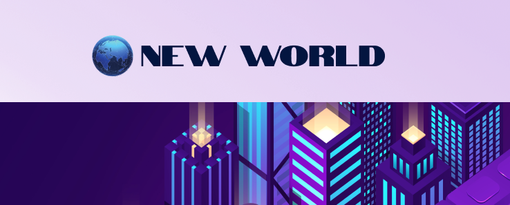
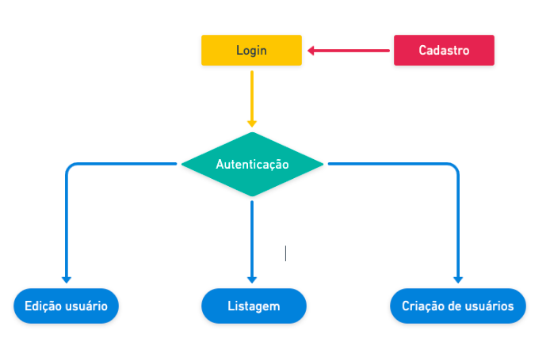
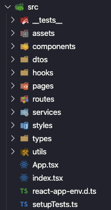

<div align="center">
  

</div>

<h2 align="center">
   New World tech challenge
</h2>

<p align="center">

  

  

  

  

  <a href="https://www.codacy.com/manual/Fred-Reis/2sow?utm_source=github.com&amp;utm_medium=referral&amp;utm_content=Fred-Reis/2sow&amp;utm_campaign=Badge_Grade">
    </a>

</p>

<blockquote align="center">
  Este projeto foi desenvolvido como um teste técnico.
</blockquote>

<hr/>

<h3 align="center">Links:</h3>

<p align="center">

  <a href="#-sobre-esse-desafio">
    
  </a>&nbsp;&nbsp;
  <a href="#-requisitos">
    
  </a>&nbsp;&nbsp;
  <a href="#-especificacoes-tecnicas">
    
  </a>&nbsp;&nbsp;
  <a href="#-arquitetura">
    
  </a>&nbsp;&nbsp;
  <a href="#-sobre-a-api">
    
  </a>&nbsp;&nbsp;
  <a href="#-testes">
    
  </a>&nbsp;&nbsp;
  <a href="#-tecnologias-e-ferramentas">
    
  </a>&nbsp;&nbsp;
  <a href="#-executando-o-projeto">
    
  </a>&nbsp;&nbsp;

  <a href="#author-frederico-reis">
    
  </a>

</p>

  <!-- <iframe
    src="https://www.youtube.com/embed/lAqOI19qbxs"
    autoplay="1"
    frameborder="0"
  /> -->


## 💡 Sobre esse desafio:

(CRUD)
A proposta do desafio era construir um sistema para cadastro, listagem, e remoção de usuários.

## 📑 Requisitos

### Tela login

- Ao se logar o usurio deverá ser direcionado para a tela de listagem;
- Deverá ter um campo email e um campo de senha;
- As únicas validações serão;

* - Email em formato válido
    Senha maior que 4 caracteres;

- Após o submit, deverá guardar um token no local-storage;

### Tela com formulário de cadastro;

- ❗️ Deverá ser acessada apenas por usuários autenticados no login;
- O formulário deverá ser responsivo;
- Todos os campos são obrigatórios;
- O formato do email deverá ser validado;
- Os campos de CEP deverão ser Inputs com máscaras;
- Deverá haver uma integração com o [ViaCEP](https://viacep.com.br/) para preenchimento dos campos de endereço;
- Deverá conter um campo para cada um dos itens abaixo:
- - Nome, CPF, Email, CEP, Rua, Número, Bairro e Cidade;

O objeto de envio para a API deverá ser nessa estrutura JSON:

```JSON
{
      nome: 'foo bar',
      cpf: '213.123.123-45',
      email: 'foo_bar@email.com',
      endereco: {
          cep: 13454000,
          rua: 'rua talvez',
          numero: 785,
          bairro: 'bairro azul',
          cidade: 'cidade eterna',
      }
  }
```

### Tela de listagem de usuários;

- Deverá ser acessada apenas por usuários autenticados no login;
- Deverá ser uma tabela com uma coluna pra nome, CPF, email e cidade;
- Deverá conter um botão para excluir o registro e um para editar;
- Deverá permitir fazer uma busca por nome;
- Não precisa ser responsiva;

**_Extras:_**

Paginação / Carregar mais / Infinite loading

### Header

- Um topbar/navbar fixo nas telas de listagem e cadastro de novos usuários;
- Um logo com nome da aplicação e mais 2 botões de navegação para as telas acima citadas;
- Ter um logout;

## 🕵🏻‍♂️ Observações:

No item que foi na marcado com o ❗️ pode-ser observar a seguinte divergência:

**_O formulário de cadastro de usuários só poderia ser acessado por usuários autenticados._**

❓Como um usuário poderia se autenticar antes de fazer o cadastro??

Pra resolver esse problema foi criado a seguinte estrutura


### ➕🎅🏼 Extras

- Foi criado um formulário para cadastro e outro para adição de novos usuários, esse segundo acessivel somente para usuários autenticados.
- Quando você cria um cadastro foi utilizado a lib [uuid](https://github.com/uuidjs/uuid#readme) para a criação de um token que será usado para autenticação.
- E para deixar a aplicação mais divertida e com um melhor aspecto visual, foi utilizado a lib [faker](https://www.npmjs.com/package/faker) cria um avatar **ALEATÓRIO** ao criar um novo usuário, portanto boa sorte 🤷🏻‍♂️😂.
- Foi utilizado [react-springs](https://www.react-spring.io/) para fazer as animações do nosso toast;
- Além da criação de um Tooltip que deixa nossas validações de erro mjuito mais elegantes.
- Foi utilizado a lib [react-simple-infinite-loading](https://www.npmjs.com/package/react-simple-infinite-loading) para criar um Infinite loading, (precisa ser refatorado para uma melhor experiência);

## 📝 Especificações Técnicas

- ✅ Deveria ser desenvolvido em React;
- ✅ Utilizar react-router para navegação;
- ✅ Tivesse algum Toast/notification;
- ⚠️ Se fosse utilizar alguma lib de UI components, dar preferência para o [SemanticUI](http://react.semantic-ui.com/).
- - Como não era um requisito obrigatório, o layout foi 100% autoral (já vimos melhores eu sei, mas só se desenvolve fazendo)
- ✅🎖 [styled-components](https://styled-components.com/);
- ✅🎖 typescript;
- ⚠️🎖 testes unitários;
- - Até o presente momento os testes cobriram 60% de toda aplicação, devendo chegar a 100% em PR futuros.
- ✅🎖 hooks;
- - Além da utilização dos **hooks** do react, foram criados nossos próprios hooks, para autenticação e envio de Toasts utilizando [Context](https://pt-br.reactjs.org/docs/context.html) também do React;
- ✅🎖 Após colocar o CEP e preencher todos os campos de endereço, mude o foco do cursor para o campo de número, para que o usuário não precise tirar a mão do teclado;

> Os itens marcados com 🎖 eram opcionais.

## 📐 Arquitetura:

O projeto foi concebido utilizando o conceito de componentização do React que facilita o reapoveitamento de código.

Estrutura:



## ⚙️ Sobre a API:

- Para emular uma API REST completa (CRUD) no backend, deveria ser usado o json-server

Para instalar o json-server:

```
 yarn global add json-server
```

Se quiser instalar local no projeto e rodar o servidor via npm scripts, fique a vontade

Rodando o json-server na raíz do projeto, ele criará um arquivo db.json;

## 🧪 Testes:

Foram implementados testes unitários utilizando [Jest](https://jestjs.io/);

Para executar os testes basta executar o seguinte comando na raiz do projeto:

```bash
$ yarn test
```

Os detalhes do teste serão apresentados no seu console.

## 🛠 Tecnologias e Ferramentas:

Algumas das tecnologias e ferramentas utilizadas nesse projeto.

- [**NodeJS**](https://nodejs.org/en/);
- [Insomnia](https://insomnia.rest/download/);
- [Notion](https://www.notion.so/?utm_source=google&utm_campaign=brand_alpha&utm_content=row&utm_term=notion&gclid=CjwKCAjw1cX0BRBmEiwAy9tKHs5ggnFG4dmfW38kOuGDTQS1-YjRGg01PuIriv8ftUuAUzeoU7QFFxoCAkIQAvD_BwE);
- EsLint;
- Prettier;
- Jest;

## 🏁 Executando o projeto:

1 - Para rodar pela primeira vez o seu projeto será necessário a criação de uma pasta.

```bash
$ mkdir <nome-da-pasta>
```

2 - Agora entre na pasta criada.

```bash
$ cd <nome-da-pasta>
```

3 - Vamos clonar o repositório

```bash
$ git clone https://github.com/Fred-Reis/2sow
```

4 - Execute o comando a seguir para a criação da pasta `node_modules`

```bash
$ yarn install
```

5 - Para iniciar o servidor em modo desenvolvimento execute o seguinte comando

```bash
$ yarn dev:server
```

5 - Para iniciar a aplicação execute o seguinte comando

```bash
$ yarn start
```

<br/>

😃 Se você chegou até aqui é sinal que tudo deu certo e você agora já pode fazer o seu cadastro e embarcar para um Novo Mundo. 🚀

<br/>

<h4 align="center">
  "Stay hungry stay foolish!"
</h4>

<br/>

---

<h3 align="center">
Author: <a alt="Fred-Reis" href="https://github.com/Fred-Reis">Frederico Reis</a>
</h3>

<p align="center">

  <a alt="Frederico Reis" href="https://www.linkedin.com/in/frederico-reis-dev/">
    </a>
  <a alt="Frederico Reis" href="https://github.com/Fred-Reis ">
  </a>

</p>

Feito com ♥️
